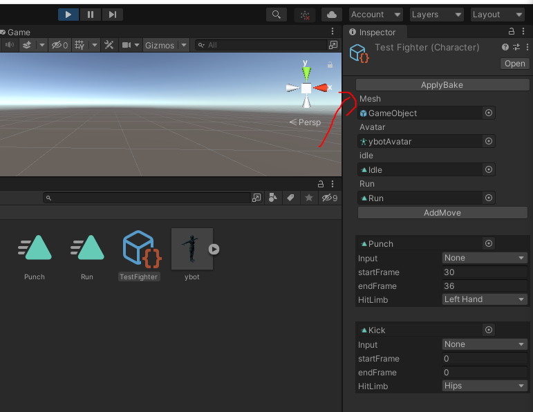

# RollbackGgpoWithEcfExampleCsharp

This is an example project I created for using rollback and custom ecf

The ecf is designed arround rollback netcode and having many different object with different data. It uses reflection to keep save and load the data for every component.

The same reflection values can be used to detect which property caused the desync.
(This example includes the code for the desync detection aswell)

It uses nykwil's ggpo wrapper for unity
https://github.com/nykwil/UnityGGPO

!!NOTE: The code in this repo is not very clean. I have been doing some quck coding and haven't had the chance to cleanup my code. Tough I am planning on cleaning up my code, I tought it would be more benefecial if people had access to this code already instead of me delaying the release in this stuff by months until I find time to cleanup.

And example of how the ECF works can be found within the Game folder.

You will have to bake the animations for it to work with rollback.
Under Assets/Characters/TestFighter you can find a Character scriptable object in which you can define animations for certain actions. After changing animations open the scene Assets/Scenes/BakerScene. Run the scene in the editor, after some time you will see a apply bake on your (character) scriptable object. Click on this button and the bake will be saved.
